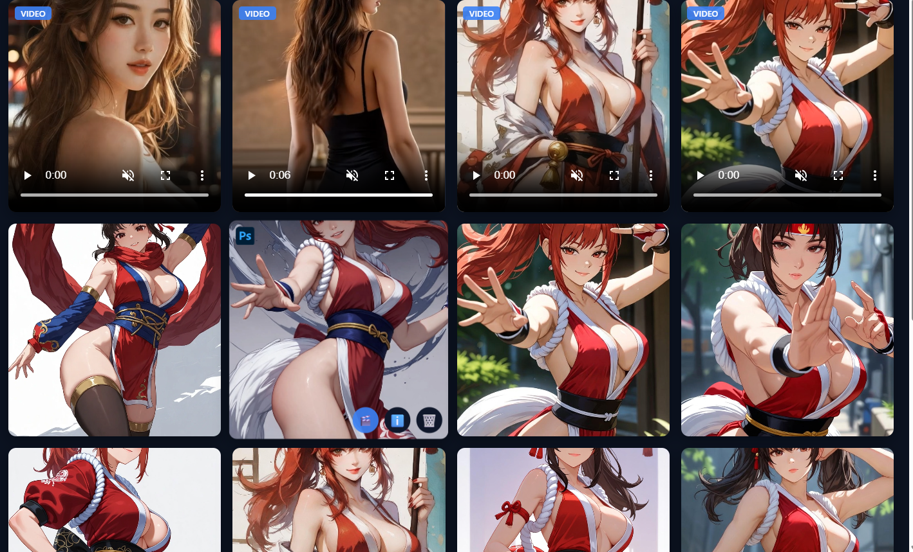

# AI Image & Video Generation

An AI-powered media generation platform built with FastAPI and SQLite. Generate images from text prompts and convert them to animated videos.



## Features

- **Text-to-Image Generation**: Create AI images from text prompts with customizable aspect ratios
- **Image-to-Video Conversion**: Convert generated images into animated videos with one click
- **Task Queue**: Configurable concurrent task management with real-time WebSocket updates
- **Image Management**: Grid display, pagination, fullscreen preview, and deletion
- **Video Playback**: Inline video player with controls
- **Multi-Config Support**: Switch between multiple API configurations
- **Persistent Storage**: SQLite database for history and prompt retrieval

## Quick Start

### 1. Install Dependencies

Create virtual environment:
```bash
python -m venv venv
```

Activate virtual environment:

Windows:
```bash
venv\Scripts\activate
```

Linux/macOS:
```bash
source venv/bin/activate
```

Install packages:
```bash
pip install -r requirements.txt
```

### 2. Configure API

Copy the example config file:
```bash
# Windows
copy data\configs.example.json data\configs.json

# Linux/macOS
cp data/configs.example.json data/configs.json
```

Edit `data/configs.json` with your API credentials:
```json
{
  "max_concurrent": 2,
  "api_configs": [
    {
      "name": "grok",
      "base_url": "https://your-api-endpoint.com",
      "api_key": "your-api-key",
      "model": "grok-imagine-1.0",
      "proxy": ""
    },
    {
      "name": "grok-video",
      "base_url": "https://your-api-endpoint.com",
      "api_key": "your-api-key",
      "model": "grok-imagine-1.0-video",
      "proxy": ""
    }
  ]
}
```

### 3. Start the Service

```bash
python app.py
```

Or use uvicorn with hot reload:
```bash
uvicorn app:app --reload --port 8989
```

### 4. Access the Website

Open your browser and visit: http://localhost:8989

## Usage

### Generate Images
1. Enter a text prompt describing the image you want
2. Select an aspect ratio (Default, 9:16, 16:9, 4:3, 1:1)
3. Choose the number of images (1-10)
4. Click **Generate**

### Convert Image to Video
1. Hover over any generated image
2. Click the **🎬** button
3. Configure video settings:
   - **Aspect Ratio**: 16:9, 9:16, or 1:1
   - **Duration**: 5 or 10 seconds
   - **Motion Description**: Optional text to guide the animation
4. Click **Generate Video**

### Manage Media
- Click any image for fullscreen preview with navigation
- Click **ℹ️** to view the original prompt
- Click **🗑️** to delete an image or video
- Videos display with a **VIDEO** badge and inline player controls

## Project Structure

```
aig_pic/
├── app.py              # FastAPI main application
├── requirements.txt    # Python dependencies
├── data/
│   ├── app.db          # SQLite database (auto-generated)
│   ├── configs.json    # API configuration (create from example)
│   └── configs.example.json  # Example configuration
├── src/
│   ├── client.py       # External API client (image & video)
│   ├── config.py       # Configuration management
│   ├── db.py           # Database operations
│   └── tasks.py        # Task queue with WebSocket broadcast
├── static/
│   ├── index.html      # Frontend page
│   ├── app.js          # Frontend logic
│   └── styles.css      # Styles
├── output/             # Generated media storage
└── doc/
    └── homepage.png    # Screenshot
```

## API Endpoints

| Method | Endpoint | Description |
|--------|----------|-------------|
| GET | `/` | Main page |
| GET | `/api/configs` | List available configurations |
| POST | `/api/tasks` | Create image/video generation task |
| GET | `/api/tasks` | List all tasks |
| GET | `/api/tasks/{id}` | Get task status |
| GET | `/api/images` | List images (paginated) |
| GET | `/api/images/{id}/prompt` | Get image prompt |
| POST | `/api/images/{id}/to-video` | Convert image to video |
| DELETE | `/api/images/{id}` | Delete image |
| WS | `/ws/tasks` | Real-time task updates |

## Tech Stack

- **Backend**: FastAPI + Uvicorn
- **Database**: SQLite
- **HTTP Client**: httpx (async)
- **Frontend**: Vanilla HTML/CSS/JavaScript
- **Real-time**: WebSocket

## License

MIT
